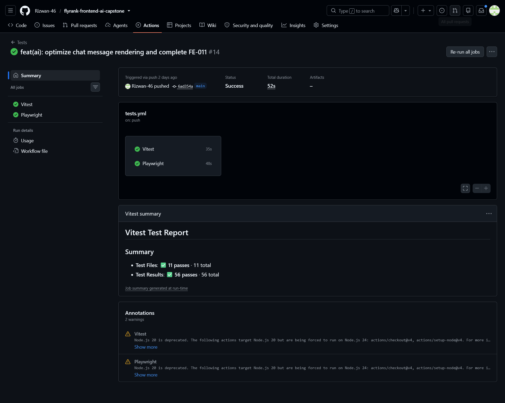

# Deployment & Operation

**Project:** Pet Care Management — Capstone
**Signed off by:** Rizwan Akbar
**Date:** September 9, 2026

---

## Deployment Checklist

### Environment & Configuration
- [x] All required environment variables documented in `.env.example`
- [x] `GEMINI_API_KEY` set in Netlify's environment variables (never committed to the repo)
- [x] `.env.local` (real secrets) is gitignored
- [x] Optional variables (`GEMINI_MODEL`, `ENABLE_AI_TEST_SENTINELS`) have sensible defaults if left unset

### AI Route Safety
- [x] Input length capped (2000 characters) before any request reaches the AI model
- [x] Simple in-memory rate limiting (15 requests/minute per IP) — an honest, scoped limit given the project has no database for a "real" distributed limiter
- [x] `maxDuration` set to 30s, confirmed against Netlify's actual streaming function limit (60s)
- [x] Errors from the AI provider (rate limits, quota exhaustion, network failures) are caught and shown as clear, safe messages — never a raw stack trace

### Testing
- [x] 56 component/unit tests passing (Vitest + React Testing Library)
- [x] 1 end-to-end test covering the primary user flow (Playwright)
- [x] AI route tested with a mocked model — no test ever calls the real Gemini API
- [x] CI (GitHub Actions) runs the full suite on every push to `main`; screenshot evidence provided separately under Testing Evidence

### Performance & Accessibility
- [x] Lighthouse run on Dashboard and AI Assistant pages (Mobile, throttled 4G)
      - Dashboard: Performance 90, Accessibility 100, Best Practices 96, SEO 100, CLS 0
      - AI Assistant: Performance 71, Accessibility 100, Best Practices 96, SEO 100, CLS 0
- [x] WAVE audit run on Home, Dashboard, and AI Assistant — 0 errors, 0 contrast errors on all three
- [x] Concrete fix applied from audit findings: corrected a skipped heading level (h1→h3) on the
      AI Assistant page to h1→h2, in `PetHealthSummaryCard.jsx`

### Deployment
- [x] Deployed to Netlify, connected to the `main` branch — every push to `main` auto-deploys
- [x] Production build (`npm run build`) verified to succeed
- [x] Live URL confirmed publicly accessible with no login/paywall in front of it

---

## How the app fails safely

- **AI errors** (network failure, rate limit, quota exhaustion, mid-stream interruption): caught server-side, converted into short, human-readable messages (e.g. "Too many requests, please wait a moment"), never a raw stack trace. Shown in a dedicated error banner with a working "Try Again" button.
- **Route/page crashes**: an `error.jsx` boundary on the AI Assistant route shows a recovery screen instead of a blank page, with a "Try Again" and "Back to Dashboard" option.
- **Form validation**: every form (pet, vaccination, appointment, login, signup) validates with Zod before submission — invalid input never reaches the app's state.
- **Empty/missing data**: every list view (pets, vaccinations, appointments, medical records) has a dedicated empty state instead of showing a blank or broken layout.
- **AI quota exhaustion** (a real external limitation, not a bug): shown as a clear "daily AI quota reached" message rather than a silent failure or crash.

## Rollback plan

1. **Instant rollback (no rebuild needed):** Netlify Dashboard → Deploys → select the last known-good build → click **Publish deploy**. Takes effect in seconds.
2. **Code-level rollback:** `git revert <commit-hash> && git push origin main` — reverts the breaking commit and triggers a new auto-deploy with the fix.
3. **Environment variable issues** (e.g. a bad API key): fixed directly in Netlify's dashboard, no redeploy required.

## Monitoring

- Netlify's built-in **Function logs** (Site → Logs → Functions) show real-time errors from the `/api/chat` route — this is how the Gemini quota-exhaustion issue and a message-parsing bug were actually diagnosed during development, using real log output rather than guesses.
- No third-party monitoring/alerting service is set up. For a project at this scale, manually checking Netlify's dashboard logs after a deploy has been sufficient. A natural next step for a larger app would be adding something like Sentry.

## Known Limitations (documented honestly, not hidden)

- Personal free-tier Gemini API key has a small daily quota, shared across all visitors
- No real backend/database — all pet data lives in browser `localStorage`, by design
- In-memory rate limiting resets on a Netlify cold start — not a distributed/bulletproof limiter
- AI Assistant page's Performance score (71) is lower than other pages due to real JS weight from streaming + markdown libraries; partially mitigated via code-splitting, documented rather than fully resolved